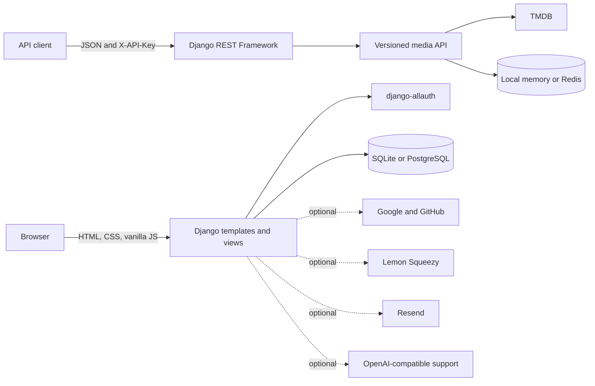

# 🎬 Linkify Media

> **A developer-friendly movie and TV metadata API with a complete Django-powered web experience.**
>
> One Python application serves the public site, account journeys, dashboard, and REST API—on the same origin.


## ✨ Product overview

Linkify Media helps developers search movie and television metadata, manage API access, and monitor usage from a polished, responsive workspace. The application is built as a unified Django project:

- 🐍 **Django templates** render the marketing site, native account forms, and dashboard.
- 🔌 **Django REST Framework** powers the versioned JSON API.
- 🎨 **Standalone CSS and vanilla browser JavaScript** provide the visual system and lightweight interactions.
- 📦 **WhiteNoise** serves collected static assets in production.

The Django web application does not need a separate frontend server, Node.js runtime, package manager, or asset build step. The optional JavaScript SDK is for API consumers; it is not part of the site runtime.

## 🧩 What’s included

| | Capability | Details |
| --- | --- | --- |
| 🎞️ | **Media discovery** | TMDB-backed movie and TV search, paginated results, trending titles, media details, recommendations, watch-provider data, and people search. |
| 🔑 | **API key controls** | Secrets are hashed at rest and shown once; keys support scopes, expiry, rotation, and revocation. |
| 🛡️ | **Usage protection** | Per-minute throttling, plan-based daily quotas, request logging, and signed, short-lived demo tokens. |
| 📈 | **Developer analytics** | Recent request counts, success rate, latency, usage history, and CSV export. |
| 🔐 | **Native accounts** | Django/allauth sign-up, sign-in, password recovery, email verification, profile management, account deletion, and MFA. |
| 🌐 | **Social sign-in** | Optional Google and GitHub authentication; provider buttons remain hidden until credentials are configured. |
| 💳 | **Billing** | Optional Lemon Squeezy checkout, signed and idempotent billing webhooks, plan changes, and customer-portal access. |
| 💬 | **Support** | Support chat with a safe fallback, optional AI assistance, and human-support ticket submission. |
| 🎨 | **Complete website UI** | Responsive landing, docs, pricing, API reference, playground, FAQ, support, status, and authenticated workspace pages. |
| 🗂️ | **Template archive** | A noindex reference page preserves the migrated template content and email copy. |

### 🧭 Data and feature boundaries

TMDB is Linkify’s metadata provider. IMDb, Rotten Tomatoes, Metacritic, Letterboxd, and JustWatch are outbound links—not separately aggregated data sources.

The dashboard keeps navigation complete without fabricating unsupported functionality: **team management, audit history, and user-managed webhook endpoints are not implemented**. Their pages explain this and do not claim that changes or records were saved. The separate billing-webhook receiver is supported when configured.

## 🏗️ Architecture



## ⚙️ Requirements

- 🐍 Python **3.12**
- 🎬 A TMDB API key for live media lookups (**optional**; the rest of the site starts without it)
- 🐳 Docker and Docker Compose (**optional**)
- 🚫 No separate frontend server, Node.js setup, or asset build is required

## 🚀 Run locally

### Linux and macOS

Extract the provided source archive, or clone the repository:

```bash
# If you downloaded the source ZIP
unzip Linkify-Media-Complete-Django.zip
cd Linkify-Media-Complete

# Or, instead, clone the repository:
# git clone https://github.com/Abdullahkhan000/Linkify-Media-Complete.git
# cd Linkify-Media-Complete
```

Create a virtual environment and start Django:

```bash
python3.12 -m venv .venv
source .venv/bin/activate
python -m pip install --upgrade pip
python -m pip install -r requirements.txt
cp .env.example .env
python manage.py migrate
python manage.py configure_social_apps
python manage.py runserver 8000
```

Open **<http://127.0.0.1:8000/>**. The website, login and registration forms, dashboard, and API are all served by this Django process. Local data uses SQLite; Redis and PostgreSQL are optional.

### Windows PowerShell

```powershell
Expand-Archive .\Linkify-Media-Complete-Django.zip
Set-Location .\Linkify-Media-Complete
py -3.12 -m venv .venv
.\.venv\Scripts\Activate.ps1
python -m pip install --upgrade pip
python -m pip install -r requirements.txt
Copy-Item .env.example .env
python manage.py migrate
python manage.py configure_social_apps
python manage.py runserver 8000
```

> **Email in development:** Without a Resend API key, account emails are printed in the Django server terminal so verification and password-reset flows can be tested locally.

## 🔧 Configuration

Copy `.env.example` to `.env`. Keep real credentials private and out of Git.

| Variable | Purpose |
| --- | --- |
| `SECRET_KEY` | Django signing key. Use a unique, randomly generated value for any public deployment. |
| `DEBUG` | `True` for local development; set to `False` in production. |
| `ALLOWED_HOSTS` | Comma-separated hostnames served by Django. |
| `CSRF_TRUSTED_ORIGINS` | Trusted scheme-and-host origins for form submissions. |
| `TMDB_API_KEY` | Enables live movie and television metadata lookups. |
| `DATABASE_URL` | Optional PostgreSQL connection; SQLite is used when omitted. |
| `REDIS_URL` | Optional Redis cache and shared rate-limit storage; local memory is used when omitted. |
| `ACCOUNT_EMAIL_VERIFICATION` | `none` is the local default; use `mandatory` only after public-domain and email delivery are ready. |
| `GOOGLE_CLIENT_ID`, `GOOGLE_CLIENT_SECRET` | Optional Google sign-in credentials. |
| `GITHUB_CLIENT_ID`, `GITHUB_CLIENT_SECRET` | Optional GitHub sign-in credentials. |
| `RESEND_API_KEY`, `DEFAULT_FROM_EMAIL` | Optional outbound account email delivery. Without a key, Django uses its console email backend. |
| `LEMONSQUEEZY_API_KEY`, `LEMONSQUEEZY_STORE_ID`, `LEMONSQUEEZY_VARIANT_PRO`, `LEMONSQUEEZY_VARIANT_BIZ`, `LEMONSQUEEZY_WEBHOOK_SECRET` | Optional checkout, subscription webhook, and customer-portal configuration. |
| `OPENAI_API_KEY`, `OPENAI_API_BASE`, `SUPPORT_BOT_MODEL` | Optional AI support assistant. The non-AI fallback remains available without credentials. |
| `MANUS_PREVIEW_ENABLED` | Enables secure cross-site cookie settings for an embedded public HTTPS Preview; keep it `False` for ordinary local HTTP development. |

### 🔐 Social sign-in setup

1. Add the provider’s client ID and secret to `.env`.
2. Set `SITE_DOMAIN` to the domain used by your Django site.
3. Run `python manage.py configure_social_apps` after migrations.
4. Register the matching callback with your provider. For local Google sign-in, use:

```text
http://localhost:8000/accounts/google/login/callback/
```

Use your public HTTPS domain and the corresponding callback path in production. Keep provider credentials private.

### 💳 Billing and email

Billing controls stay unavailable until the required Lemon Squeezy credentials are present. Configure the webhook URL as:

```text
https://your-domain.example/billing/webhook/
```

Use the webhook secret from the provider dashboard. The receiver verifies the signature and ignores duplicate event IDs. For email verification, configure a sending domain and delivery provider before changing `ACCOUNT_EMAIL_VERIFICATION` from `none` to `mandatory`.

## 🔌 API guide

The versioned API base path is **`/api/v1/`**. Send API secrets only in the `X-API-Key` header—never in a URL, public browser bundle, or support message.

### 🎬 Search example

```bash
curl --get "http://localhost:8000/api/v1/search/" \
  --data-urlencode "q=Inception" \
  --data-urlencode "type=movie" \
  --data-urlencode "country=us" \
  -H "X-API-Key: lm_live_your_secret"
```

### 📚 Endpoint reference

| Method | Endpoint | Purpose |
| --- | --- | --- |
| `GET` | `/api/v1/search/` | Search for a movie or TV title. |
| `GET` | `/api/v1/search/results/` | Paginated title search with optional year and genre filters. |
| `GET` | `/api/v1/media/{movie\|tv}/{id}/` | Media details, recommendations, and country-specific watch-provider data. |
| `GET` | `/api/v1/trending/` | Weekly trending titles. |
| `GET` | `/api/v1/people/search/` | Search actors and other creators. |
| `POST` | `/api/v1/batch/` | Search several titles in one request. |
| `GET` | `/api/v1/usage/` | Read the current API key’s usage and remaining quota. |

Search fields can be selected with the `fields` query parameter. Supported aliases include `title`, `year`, `genres`, `runtime`, `rating`, `poster`, `cast`, `tmdb`, `imdb`, and `justwatch`.

### 📦 Batch example

```bash
curl -X POST "http://localhost:8000/api/v1/batch/" \
  -H "Content-Type: application/json" \
  -H "X-API-Key: lm_live_your_secret" \
  -d '{"items":[{"q":"Dune","type":"movie"},{"q":"The Bear","type":"tv"}]}'
```

Batch access requires the `batch` scope and a Pro or Business plan. Per-request limits are **3 demo items**, **25 Pro items**, and **100 Business items**.

### 📊 Current plan limits

| Plan | Daily requests | Per-minute requests |
| --- | ---: | ---: |
| Free | 100 | 20 |
| Pro | 5,000 | 120 |
| Business | Unlimited | 600 |

API-key scopes are `search`, `batch`, and `usage`. The account dashboard is the place to create, rotate, and revoke keys. A newly issued secret is displayed once; store it in a password manager or server-side secret store.

### 📖 API documentation

- **OpenAPI 3.1 schema:** [`/api/schema/`](http://localhost:8000/api/schema/)
- **Swagger UI:** [`/api/docs/`](http://localhost:8000/api/docs/)
- **Interactive playground:** [`/playground/`](http://localhost:8000/playground/)
- **Developer reference:** [`/api-reference/`](http://localhost:8000/api-reference/)

## 🧭 Site map and operations

| Area | Routes |
| --- | --- |
| 🌐 Public pages | `/`, `/about/`, `/docs/`, `/pricing/`, `/privacy/`, `/terms/`, `/faq/`, `/support/`, `/status/` |
| 🧑‍💻 Developer workspace | `/dashboard/`, `/profile/`, `/analytics/`, `/usage-logs/`, `/billing/` |
| 🔐 Account journeys | `/accounts/login/`, `/accounts/signup/`, `/accounts/password/reset/`, `/accounts/email/`, `/accounts/2fa/` |
| 🧪 API tools | `/playground/`, `/api-reference/`, `/api/schema/`, `/api/docs/` |
| 🩺 Health checks | `GET /api/health/`, `GET /api/ready/` |
| 🗺️ Site metadata | `/manus-routes.json`, `/robots.txt` |
| 🗂️ Template archive | `/template-reference/` (noindex) |

The template archive keeps the **58 original HTML templates and 6 plain-text email templates**, plus **5 shared Django shells**: 69 entries in total. Regenerate the migration data with:

```bash
python scripts/generate_django_template_data.py
```

## 🐳 Docker Compose

Docker is optional. From the repository root:

```bash
cp .env.example .env
docker compose up --build -d
docker compose ps
docker compose logs -f web
```

Open **<http://localhost:8000/>**. Compose runs Django/Gunicorn and Redis; SQLite data, collected static files, and Redis data use named volumes. The container entrypoint applies migrations, configures available social providers, and collects static files. To stop the services, run `docker compose down`.

## 🧪 Checks

```bash
python manage.py check
python manage.py makemigrations --check --dry-run
python manage.py test
python manage.py collectstatic --noinput
python manage.py check --deploy
```

`check --deploy` is a production-readiness review. Warnings under local `DEBUG=True` are expected; assess each warning against your actual host, proxy, HTTPS, database, and email setup.

## 🗂️ Project layout

```text
api/          Django API, models, authentication helpers, migrations, and page views
core/         Django settings, root URLs, ASGI/WSGI entry points
templates/    Public pages, dashboard, and native account/MFA/social templates
static/       CSS, vanilla JavaScript, icons, images, and the route manifest
scripts/      Reproducible Django template migration utility
sdk/python/   Optional Python API client
sdk/javascript/ Optional JavaScript API client for API consumers
postman/      Importable API collection
docker/       Container entrypoint
```

## 📄 License

Released under the [MIT License](LICENSE).
